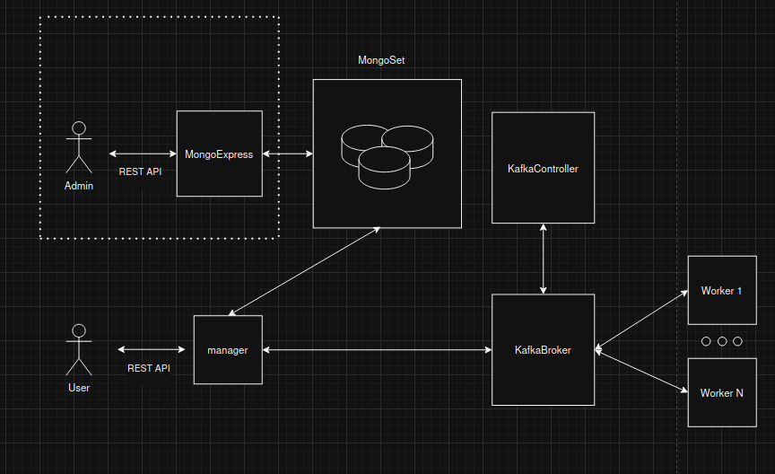

# Hash API

## Описание
Распределенная система для перебора md5 хэшей.

## Запуск сервера через Docker Compose

```sh
docker-compose up
```

## URL по умолчанию

API пользователя доступен по адресу: `http://localhost:8081`, API MognoExpress: `http://localhost:8888` 

## Эндпоинты

### 0. MongoExpress

*Логин и пароль по умолчанию не задан, управление через UI mongo express

### 1. Запрос на взлом хэша

**URL:** `/api/hash/crack`

**Метод:** `POST`

**Описание:** Отправляет хэш для взлома.

**Тело запроса (JSON):**
```json
{
  "hash": "5d41402abc4b2a76b9719d911017c592",
  "maxLength": "5"
}
```

**Ответ (JSON):**
```json
{
  "requestId": "34245"
}
```

---

### 2. Получение статуса взлома

**URL:** `/api/hash/status`

**Метод:** `GET`

**Описание:** Возвращает статус выполнения задачи по взлому хэша.

**Параметры запроса:**
- `request_id` (ID) - Идентификатор задачи

**Пример запроса:**
```sh
curl -X GET "http://localhost:8081/api/hash/status?request_id=123"
```



